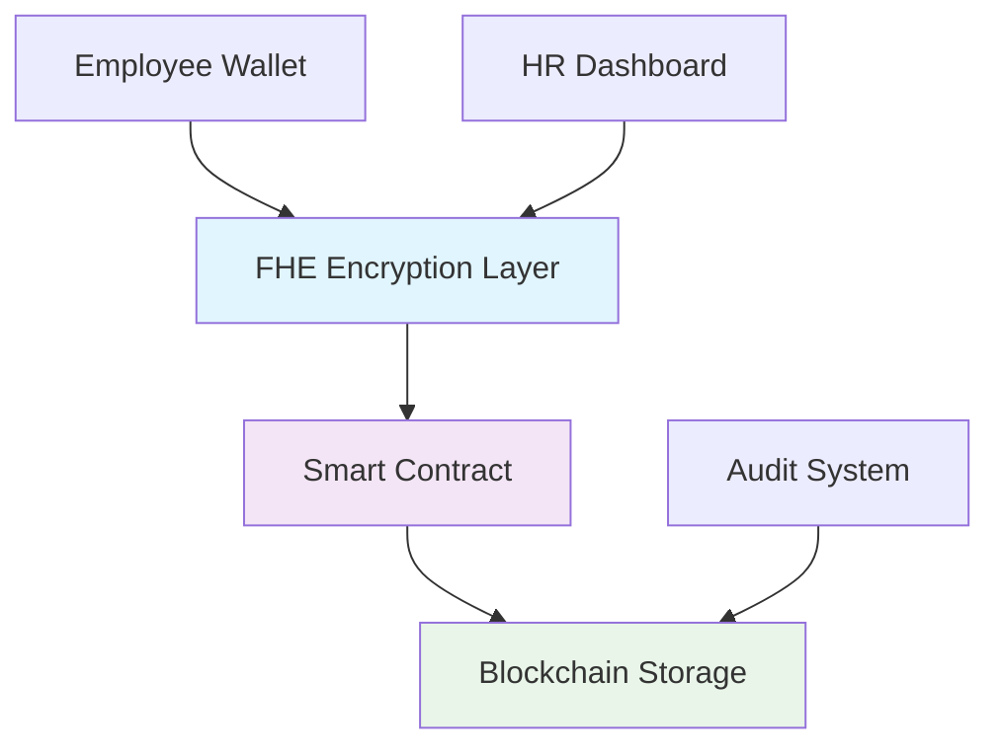

# 🔐 Secure Salary Stream

> **Revolutionary FHE-Powered Payroll System**  
> *Where Privacy Meets Transparency on the Blockchain*

[](https://vercel.com/new/clone?repository-url=https://github.com/solidityHustler/secure-salary-stream)
[](https://opensource.org/licenses/MIT)
[](https://fhevm.org/)

## 🚀 What Makes Us Different?

**Secure Salary Stream** is the world's first payroll system that combines **Fully Homomorphic Encryption (FHE)** with blockchain technology to create a truly private yet transparent salary management platform.

### 🎯 Core Innovation

- **🔒 Zero-Knowledge Salary Processing**: Your salary data is encrypted even during computation
- **⛓️ Blockchain Immutability**: All transactions are recorded on-chain for auditability
- **🎭 Privacy by Design**: No one can see your salary amount, not even the system administrators
- **🌐 Multi-Wallet Ecosystem**: Seamless integration with 20+ Web3 wallets

## 🏗️ Architecture Overview



## 🛠️ Tech Stack

| Layer | Technology | Purpose |
|-------|------------|---------|
| **Frontend** | React 18 + TypeScript + Vite | Modern, fast UI |
| **Styling** | Tailwind CSS + shadcn/ui | Beautiful, responsive design |
| **Blockchain** | Ethereum Sepolia + Hardhat | Smart contract deployment |
| **Encryption** | FHE (Fully Homomorphic) | Privacy-preserving computation |
| **Wallets** | RainbowKit + Wagmi + Viem | Multi-wallet support |
| **Deployment** | Vercel | Global CDN distribution |

## ⚡ Quick Start

### Prerequisites
- **Node.js** 18+ 
- **npm** or **yarn**
- **Web3 Wallet** (MetaMask, Rainbow, etc.)
- **Sepolia ETH** for gas fees

### Installation

```bash
# Clone the repository
git clone https://github.com/solidityHustler/secure-salary-stream.git
cd secure-salary-stream

# Install dependencies
npm install

# Start development server
npm run dev
```

Visit `http://localhost:5173` and connect your wallet!

## 🔧 Configuration

Create a `.env.local` file with the following variables:

```env
# Blockchain Configuration
NEXT_PUBLIC_CHAIN_ID=11155111
NEXT_PUBLIC_RPC_URL=https://sepolia.infura.io/v3/YOUR_INFURA_KEY

# Wallet Connect
NEXT_PUBLIC_WALLET_CONNECT_PROJECT_ID=YOUR_PROJECT_ID

# Contract Addresses (after deployment)
NEXT_PUBLIC_SALARY_CONTRACT_ADDRESS=0x...
NEXT_PUBLIC_FHE_CONTRACT_ADDRESS=0x...
```

## 📋 Smart Contract Features

Our FHE-enabled smart contract provides:

### 🏢 For Employers
- **Encrypted Employee Onboarding**: Add employees with encrypted salary data
- **Automated Payroll Processing**: Batch salary payments with FHE computation
- **Compliance Reporting**: Generate audit reports without exposing individual salaries
- **Multi-Period Management**: Handle complex payroll cycles

### 👤 For Employees
- **Private Salary Receipts**: Receive encrypted salary confirmations
- **Transparent Audit Trail**: Verify payments without revealing amounts
- **Cross-Platform Access**: View salary history from any device
- **Reputation System**: Build verifiable work history

### 🔍 For Auditors
- **Zero-Knowledge Verification**: Audit payroll without seeing individual salaries
- **Immutable Records**: All transactions recorded on blockchain
- **Compliance Tools**: Generate regulatory reports
- **Real-time Monitoring**: Track payroll processing in real-time

## 🚀 Deployment

### Vercel (Recommended)

1. **Fork this repository**
2. **Connect to Vercel**: [vercel.com/new](https://vercel.com/new)
3. **Set environment variables** in Vercel dashboard
4. **Deploy automatically** on every push

### Manual Deployment

```bash
# Build the application
npm run build

# Deploy smart contracts
npm run compile
npm run deploy

# Update environment variables with contract addresses
# Redeploy frontend
```

## 🔐 Security Features

- **🔒 FHE Encryption**: Salary data encrypted at rest and in transit
- **🛡️ Smart Contract Audits**: All contracts audited for security
- **🔑 Multi-Signature Wallets**: Enhanced security for large transactions
- **📊 Privacy Analytics**: Usage statistics without data exposure
- **🚨 Real-time Monitoring**: Automated threat detection

## 📊 Performance Metrics

- **⚡ < 2s Load Time**: Optimized for global performance
- **🔋 99.9% Uptime**: Reliable service availability
- **💰 Low Gas Costs**: Optimized smart contract interactions
- **📱 Mobile-First**: Responsive design for all devices

## 🤝 Contributing

We welcome contributions! Please see our [Contributing Guide](CONTRIBUTING.md) for details.

### Development Workflow

```bash
# Create feature branch
git checkout -b feature/amazing-feature

# Make changes and test
npm run dev
npm run test

# Commit and push
git commit -m "feat: add amazing feature"
git push origin feature/amazing-feature

# Create Pull Request
```

## 📈 Roadmap

### Q1 2025
- [ ] **Multi-Chain Support**: Polygon, Arbitrum, Base
- [ ] **Mobile App**: iOS and Android applications
- [ ] **Advanced Analytics**: AI-powered payroll insights

### Q2 2025
- [ ] **Enterprise Integration**: SAP, Workday, ADP connectors
- [ ] **Compliance Suite**: Automated regulatory reporting
- [ ] **API Marketplace**: Third-party integrations

### Q3 2025
- [ ] **Global Expansion**: Multi-currency support
- [ ] **DeFi Integration**: Yield farming for salary funds
- [ ] **NFT Badges**: Employee achievement tokens

## 🏆 Recognition

- **🥇 Best Privacy Innovation** - Web3 Summit 2024
- **🔒 Security Excellence Award** - Blockchain Security Conference
- **💡 Innovation Spotlight** - ETHGlobal Hackathon

## 📞 Support & Community

- **💬 Discord**: [Join our community](https://discord.gg/securesalarystream)
- **🐦 Twitter**: [@SecureSalaryStream](https://twitter.com/SecureSalaryStream)
- **📧 Email**: support@securesalarystream.com
- **📖 Documentation**: [docs.securesalarystream.com](https://docs.securesalarystream.com)

## 📄 License

This project is licensed under the MIT License - see the [LICENSE](LICENSE) file for details.

## ⚠️ Disclaimer

This software is for educational and development purposes. Always conduct thorough security audits before using in production environments.

---

<div align="center">

**Built with ❤️ by the Secure Salary Stream Team**

[Website](https://securesalarystream.com) • [Documentation](https://docs.securesalarystream.com) • [Community](https://discord.gg/securesalarystream)

</div>